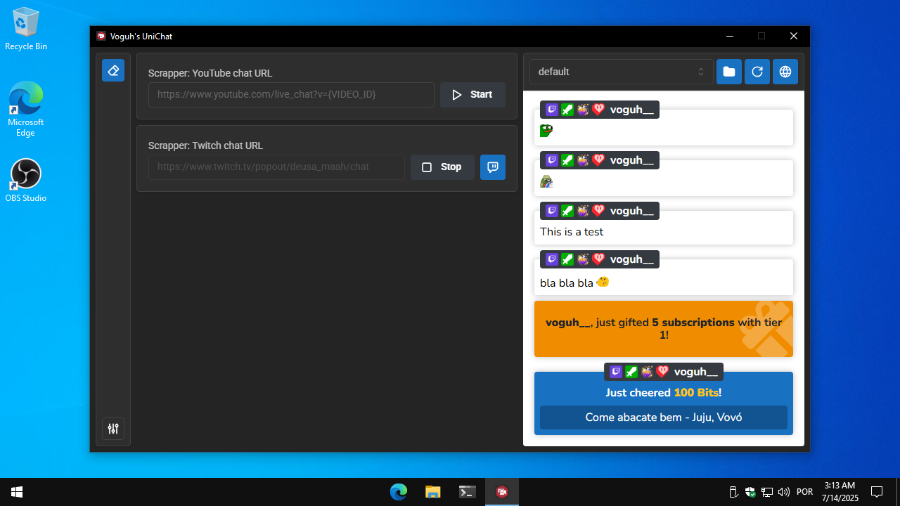

# Voguh's UniChat

[](https://github.com/voguh/unichat/releases)
[](./LICENSE)
[]()

UniChat is a tool for streamers who broadcast on YouTube and Twitch, providing a chat widget with support for third-party emotes and customization via HTML/CSS/JS.

<p align="center">
  
</p>


## ✨ Features

- **Multi-platform:** Support for Twitch and YouTube.
- **Third-Party Emotes:** Integration with BetterTTV, FrankerFaceZ, and 7TV.
- **Chat Events:** Full support for messages, donations, subscriptions, raids, and more.
- **Customizable Widgets:** Create and customize your own chat widgets using web technologies.
- **Open Source:** Licensed under MPL-2.0, allowing contributions and modifications.


## 🚀 Installation

You can download the latest version for Windows and Linux directly from the project's [Releases page](https://github.com/voguh/unichat/releases).

-   **Windows:** Download the `.exe` installer.
-   **Linux:** Choose the ideal package for your distribution (`.deb`, `.rpm`, or `.AppImage`).

For users who wish to compile from the source code, instructions are available in the [For Developers](#-for-developers) section.


## ⚙️ How to Use

1.  After launching the application, add the YouTube and/or Twitch channels you want to monitor.
2.  The application will generate a URL for the chat widget (You can open the URL by clicking the globe icon in the top right corner).
3.  Add this URL as a browser source in your streaming software (e.g., OBS Studio).
4.  Customize your widgets in the user's widgets folder, which you can access by clicking the folder icon in the top right corner.


## 👨‍💻 For Developers

Interested in contributing? Great! Here's the information you need to get started.

### App Directories

| Directory Type       | Location on Linux             | Location on Windows           |
|----------------------|-------------------------------|-------------------------------|
| `app_cache_dir`      | `~/.cache/unichat`            | `%localappdata%\unichat`      |
| `app_config_dir`     | `~/.config/unichat`           | `%appdata%\unichat`           |
| `app_data_dir`       | `~/.local/share/unichat`      | `%appdata%\unichat`           |
| `app_local_data_dir` | `~/.local/share/unichat`      | `%localappdata%\unichat`      |
| `app_log_dir`        | `~/.local/share/unichat/logs` | `%localappdata%\unichat\logs` |

### Building the Project

**Prerequisites:**
- Rust v1.87.0;
- Node.js v24.10.0;
- PNPM v10.7.1;
- Tauri v2 dependencies for your platform. Follow the [official guide](https://v2.tauri.app/start/prerequisites/);
- Tauri CLI (You can install it with `cargo install tauri-cli --locked`);

**Steps to compile:**

1.  **Install frontend dependencies:**
    ```sh
    pnpm --dir="./webapp" install --frozen-lockfile
    ```

2.  **Compile and run the application:**
    ```sh
    cargo tauri build
    ```

> [!TIP]
> If the build fails on macOS or Linux, try adding the `NO_STRIP=true` environment variable before the command. Ex: `NO_STRIP=true cargo tauri build`.

### Known Issues

-   **Wayland:** Tauri may have rendering and window scaling issues on Wayland. To work around this, run the application forcing the GDK backend to X11:
    ```sh
    GDK_BACKEND="x11" cargo tauri dev
    ```


## 📜 License

This project is licensed under the [Mozilla Public License, Version 2.0](./LICENSE).

The widgets located in the [`widgets directory`](./widgets/) are licensed under the MIT license.
